#                                  # Linux Foundation

* __Linux – The Operating System__

* RedHat Linux, Ubuntu,  Centos, SUSE etc are called as distributions.

* Distribution is Linux + software suite of applications,developer tools

* In this essence Linux is core of the operating system: `kernel`

  # Layers of Abstraction in Linux 

* __General Linux System Organization__

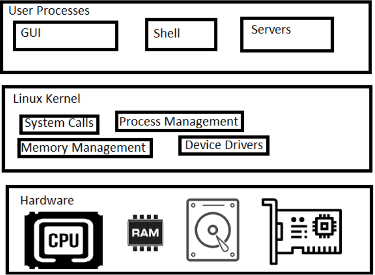

* # Layers are
    
      * Hardware
      * Kernel
      * User Process

* __Kernel is in charge for managing__
     
      * Processes
      * Memory
      * Device Drivers
      * System Calls 
         * fork
         * exec   

# User Space: 

* Kernel allocates memory for user processes and this is called as userspace.

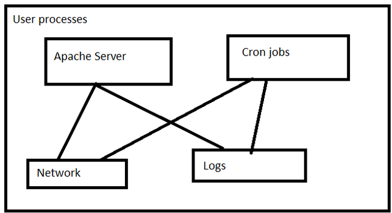
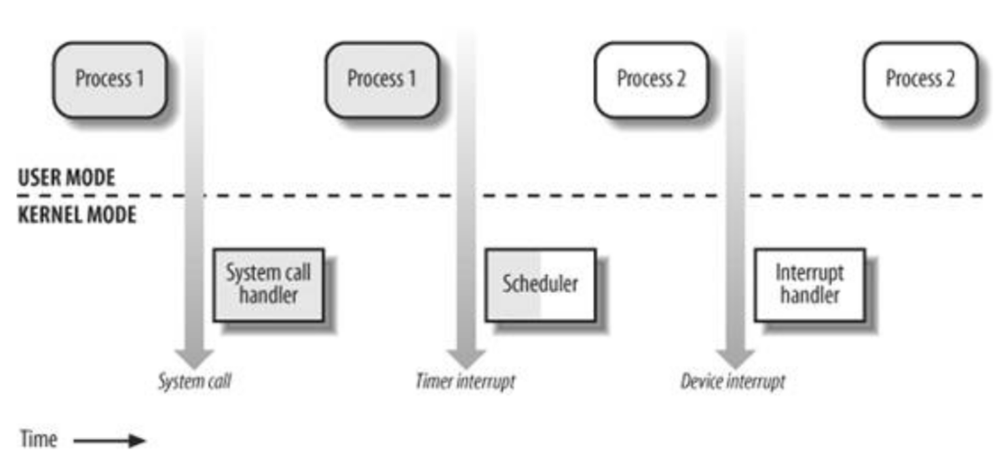

* User: A user is an entity that can run processes and own files.

# Shell and Terminal

* when we speak of the commandline we are referring to shell. Shell is a program takes commands and passes them to OS to carry out.

* Almost all the distributions a shell program called as bash is supplied.

* To interact with shell we need a terminal

# Creating Linux Instances on the cloud

* Refer Here: https://www.youtube.com/watch?v=mRILfUNbsIo for setting up the softwares

* Refer Here: https://www.youtube.com/watch?v=me2s3mTNwGo&list=PLuVH8Jaq3mLszrC7lv68a0VcrDripW-HK&index=3 for creating a linux ec2 instance in aws

* Refer Here: https://www.youtube.com/watch?v=P9X-4Z-NeGg&list=PLuVH8Jaq3mLuqXuGs6aeqxhuvCYSzB1kT&index=3 for creating a linux azure vm

* Prerequisities 

       * Softwares
           * Git Bash
           * Visual Studio Code

       * One free tier cloud account (AWS/Azure)    

* __Linux Distributions__

       * Ubuntu 18
       *  Centos 7

* Lets create a linux instance and login into that 

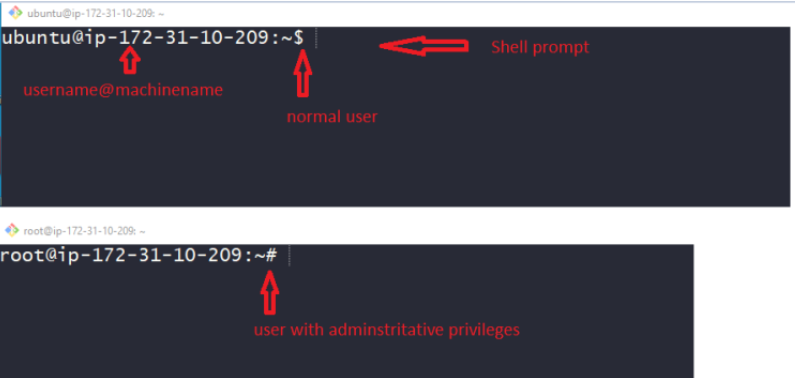

# Standard Input and Standard Output

* Linux Processes use I/O streams to read and write data.
* Streams are very flexible, the source of input stream can be a file, device or it can be even the output stream of other process

# Linux Commands

* In the shell prompt we generally execute commands. Lets execute some simple commands

```
date
cal
```
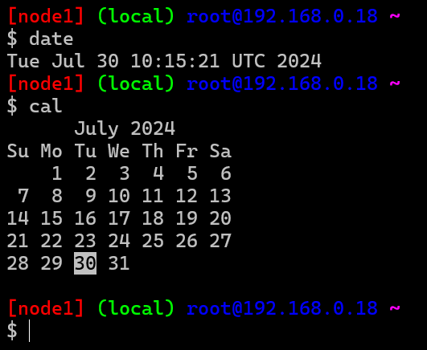

* #    Basic command syntax

```
<command> <args>
echo hello
```

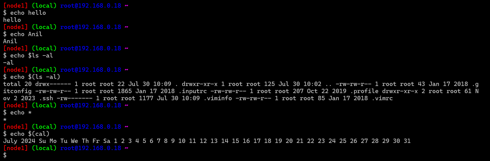
  
*  Arguments of two types 
    
    * Positional arguments:
```
<command> <arg1> <arg2> ...
cp 1.txt 2.txt
```
   
   * Named arguments

```
<command> --<argname> <argumentvalue>
ping -c 4 google.com 
```

# ls: 
   * this command is used to list the contents of the directory
     
     ```
     ls 
     ls -al
     ```
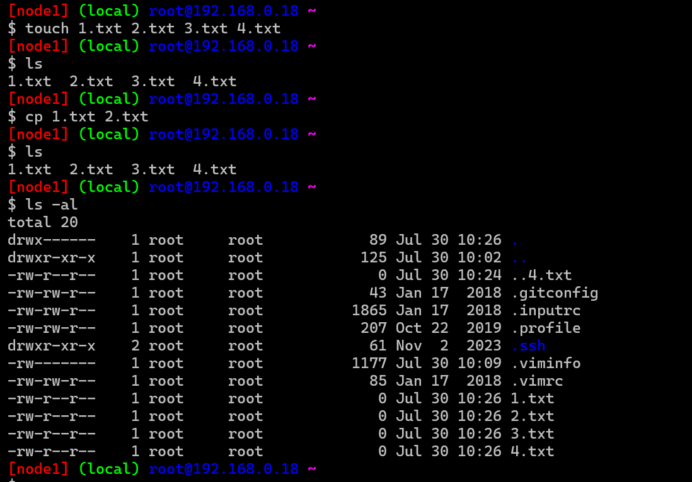

#  touch: 
   * this command creates an empty file
   * ```
     touch 1.txt
     ```
#  cp: 
   * this command copies files
   * ```
     cp 1.txt 2.txt or file1 file2
     ```

# Top 50 Linux Commands You Must Know as a Regular User

    ```
    ls - The most frequently used command in Linux to list directories
    pwd - Print working directory command in Linux
    cd - Linux command to navigate through directories
    mkdir - Command used to create directories in Linux
    mv - Move or rename files in Linux
    cp - Similar usage as mv but for copying files in Linux
    rm - Delete files or directories
    touch - Create blank/empty files
    ln - Create symbolic links (shortcuts) to other files
    clear - Clear the terminal display
    cat - Display file contents on the terminal
    echo - Print any text that follows the command
    less - Linux command to display paged outputs in the terminal
    man - Access manual pages for all Linux commands
    uname - Linux command to get basic information about the OS
    whoami - Get the active username
    tar - Command to extract and compress files in linux
    grep - Search for a string within an output
    head - Return the specified number of lines from the top
    tail - Return the specified number of lines from the bottom
    diff - Find the difference between two files
    cmp - Allows you to check if two files are identical
    comm - Combines the functionality of diff and cmp
    sort - Linux command to sort the content of a file while outputting
    export - Export environment variables in Linux
    zip - Zip files in Linux
    unzip - Unzip files in Linux
    ssh - Secure Shell command in Linux
    service - Linux command to start and stop services
    ps - Display active processes
    kill and killall - Kill active processes by process ID or name
    df - Display disk filesystem information
    mount - Mount file systems in Linux
    chmod - Command to change file permissions
    chown - Command for granting ownership of files or folders
    ifconfig - Display network interfaces and IP addresses
    traceroute - Trace all the network hops to reach the destination
    wget - Direct download files from the internet
    ufw - Firewall command
    iptables - Base firewall for all other firewall utilities to interface with
    apt, pacman, yum, rpm - Package managers depending on the distribution
    sudo - Command to escalate privileges in Linux
    cal - View a command-line calendar
    alias - Create custom shortcuts for your regularly used commands
    dd - Majorly used for creating bootable USB sticks
    whereis - Locate the binary, source, and manual pages for a command
    whatis - Find what a command is used for
    top - View active processes live with their system usage
    useradd and usermod - Add a new user or change existing user data
    passwd - Create or update passwords for existing users
    
    ```

# Linux directory hierarchy

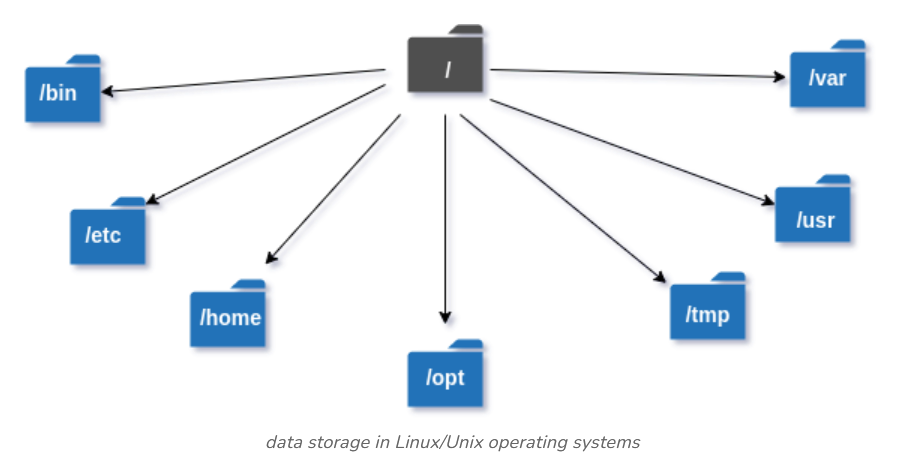

```
Directories   | 	Description
/bin 	            binary or executable programs.
/etc 	            system configuration files.
/home 	            home directory. It is the default current directory.
/opt 	            optional or third-party software.
/tmp            	temporary space, typically cleared on reboot.
/usr 	            User related programs.
/var  	            log files.

```

# Environment and Shell variables

* __Shell variables__: Shell can temporarily store variables called as shell variables

```
<VAR-NAME>=<value>
TOPIC=linux
To access variable use $
echo $TOPIC
```

* __Environmental variable__: This is also like shell variable, but its not specific to the shell.

* Environmental variables in Linux are dynamic values that can affect the behavior of processes and applications on the system. They are used to store system-wide values, such as the locations of executables, the default editor, and system locale settings.

* Managing Environmental Variables

* Viewing Environmental Variables

* to view specific environmental variable 
* `echo $HOME`
* `echo $HOSTNAME` 

      * To view all environmental variables:
          * `printenv or env`
      
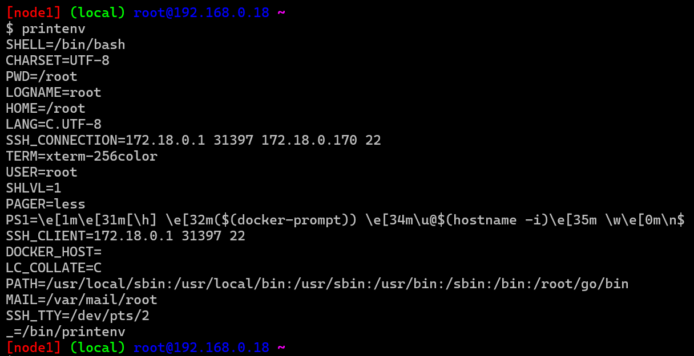

 * To view a specific variable:
      * `echo $VARIABLE_NAME`

 * For example, to view the PATH variable:
      * `echo $PATH`

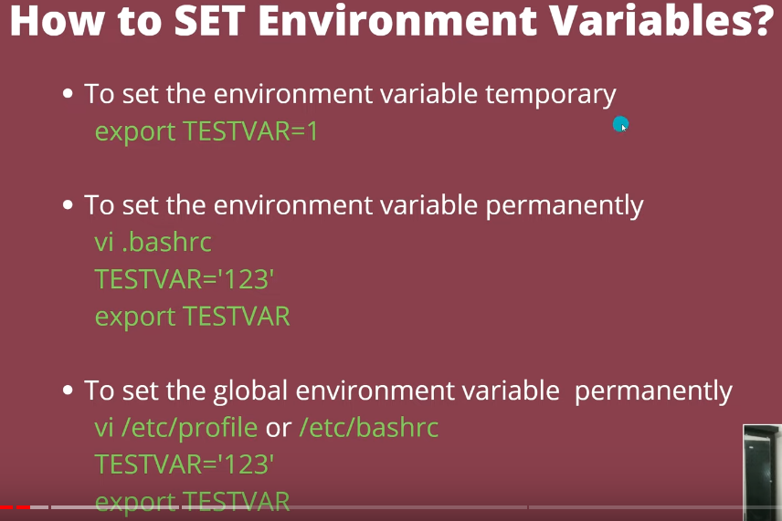

# Setting Environmental Variables

* __Temporarily (Session-specific)__: These variables last only for the duration of the session (i.e., until you log out or close the terminal).

```
VARIABLE_NAME=value
export VARIABLE_NAME

```
* Example

```
MY_VAR="Hello World"
export MY_VAR
echo $MY_VAR

```
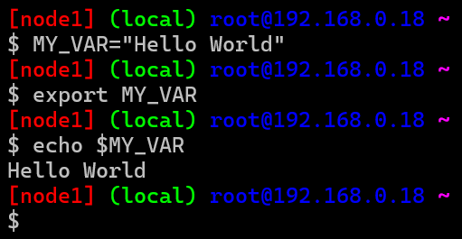

* __Permanently (Across Sessions)__: To make variables permanent, add them to configuration files like .bashrc, .bash_profile, or `/etc/environment`

* User-specific: Add to ~/.bashrc or ~/.bash_profile

```
echo 'export MY_VAR="Hello World"' >> ~/.bashrc
source ~/.bashrc

```

* System-wide: Add to /etc/environment

```
sudo echo 'MY_VAR="Hello World"' >> /etc/environment

```
* Example 1: Setting PATH

* Add a directory to your PATH so that executables in that directory can be run without specifying their full path.

`export PATH=$PATH:/new/directory/path`

* To make it permanent, add the above line to your `~/.bashrc or ~/.bash_profile.`


* taking backup of orignal final `cp /etc/profile /etc/profil_orignal` for saftey purpose 


* now to revert the value 
* `vi .bashrc` 
* change the value `TESTVAR=xyz to TESTVAR`
* `source .bashrc`

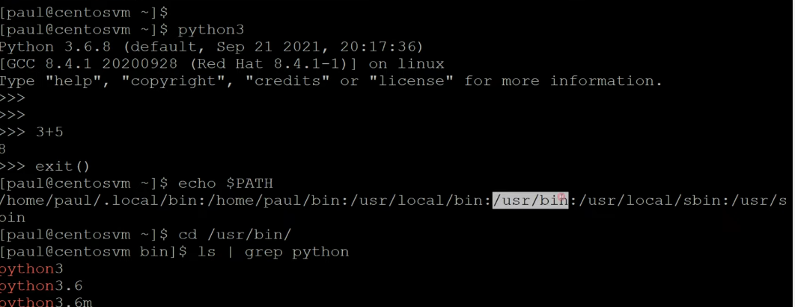

* # Example 2: Setting JAVA_HOME

* For __Java applications__, you often need to set the JAVA_HOME variable to point to your JDK installation.

```
export JAVA_HOME=/usr/lib/jvm/java-11-openjdk-amd64
export PATH=$PATH:$JAVA_HOME/bin

```
* To make it permanent, add the above lines to your ~/.bashrc or ~/.bash_profile.

* # Example 3: Custom Variable

* Create and use a custom variable for a session.

```
MY_APP_CONFIG=/path/to/config
export MY_APP_CONFIG
echo $MY_APP_CONFIG

```
* To make it permanent, add the export line to your ~/.bashrc or ~/.bash_profile.

* # Conclusion

* Environmental variables are essential for managing the operating environment in Linux. They help configure the system, define user preferences, and ensure that applications find the resources they need. Understanding how to view, set, and persist these variables is crucial for effective system administration and user configuration.

* refer : https://www.youtube.com/watch?v=NdkeNZoiFgc


```
export <variable>
```
* `There is one important environmental variable which is PATH. PATH variable will inform linux to find the commands`

```
echo $PATH
```

# Using Text Editors

* Every linux generally has a text editor which is vim.
* To learn using vim please refer here: https://www.openvim.com/ 
* Other editor is nano 